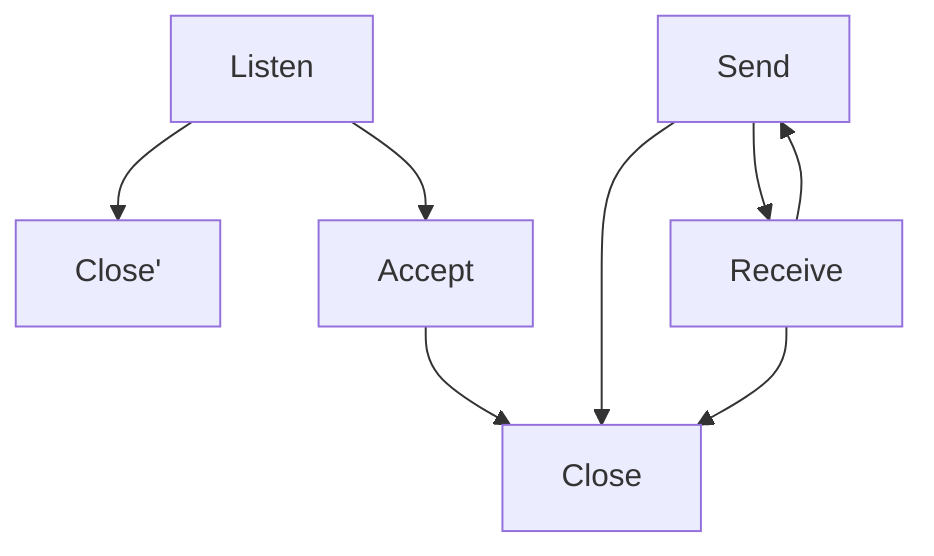

# Homework 1 - A Small Web Server

## 1 Introduction

Communications between different computers depend on transmission protocol, server processes, client processes etc. The web server has significant contributions to this process. In this seminar, I acquired knowledge of Erlang socket API, how the server process works and how to parse HTTP requests. Based on this, I built a small web server with the basic functions of receiving and sending messages.

## 2 Main problems and solutions

### 2.1 How TCP Sockets works

Understanding how TCP sockets works is vital in building this small web server. By reading official documentation and blogs, I learnt that the TCP socket works like the figure1. Unlike UDP, TCP needs to listen the socket so that it can set sessions up.

1> test:bench(localhost, 8080).
4715212
2> test:bench(localhost, 8080).
4712756
3> test:bench(localhost, 8080).
4671182
4> test:bench(localhost, 8080).
66091943
5> test:bench(localhost, 8080).
4656231
6> test:bench(localhost, 8080).
4650293
7> test:bench(localhost, 8080).
4668929
8> test:bench(localhost, 8080).
4690023
9> test:bench(localhost, 8080).
4676302
10> test:bench(localhost, 8080).
4653467
11> test:bench(localhost, 8080).
4676711

## Evaluation

### The throughput of Rudy

The server-side code is in file `rudy.erl`, and the test code is in file `test.erl`. Run `rudy.erl` first, and then run `test.erl` for ten times. The time it takes to process 100 requests is shown in Table 1.

There are $100$ requests in \codeword{test.erl}, and for each reply of Rudy it has $40 ms$ delay. Therefore there are approximately $100 \times 40ms = 4000ms = 4s$ delay. The test results shown in Figure \ref{fig:time to process request} conform to this expectation. This also show that artificial delay has a significant impact on handling requests.
