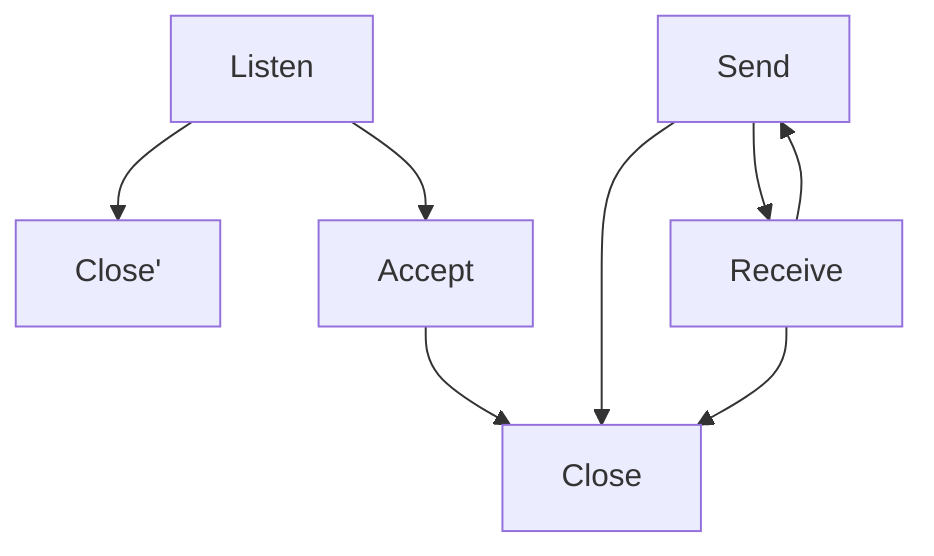

# Homework 1 - A Small Web Server

## 1 Introduction

Communications between different computers depend on transmission protocol, server processes, client processes etc. The web server has significant contributions to this process. In this seminar, I acquired knowledge of Erlang socket API, how the server process works and how to parse HTTP requests. Based on this, I built a small web server with the basic functions of receiving and sending messages.

## 2 Main problems and solutions

### 2.1 How TCP Sockets works

Understanding how TCP sockets works is vital in building this small web server. By reading official documentation and blogs, I learnt that the TCP socket works like the figure1. Unlike UDP, TCP needs to listen the socket so that it can set sessions up.

